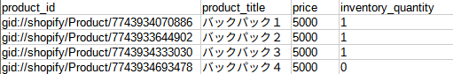

# powerful2025-item-delete (商品削除)

## 前提条件
- Shopifyに開発ストアpowerful2025が存在
- 開発ストアのAPIトークン作成済
- リモートリポジトリ作成済

## 処理概要
- inputフォルダ内の入力CSVファイルの商品情報を読み取り、開発ストアpowerful2025から削除

## 入力ファイルのサンプル ※商品一覧のプログラムで出力した商品一覧を編集


## 環境構築
### ローカルリポジトリ作成
```bash
## パッケージ更新
$ sudo apt update
$ sudo apt upgrade
$ sudo apt install python3-venv -y

## ディレクトリ移動
$ mkdir ~/powerful2025-item-delete
$ cd powerful2025-item-delete

## ローカルリポジトリ初期化
$ git init
$ git config --global user.email (自分のメールアドレス)
$ git config --global user.name Makoto-Araki

## リモートリポジトリ設定
$ git branch -M main
$ git remote add origin git@github.com:Makoto-Araki/powerful2025-item-delete.git
```

### 開発準備
```bash
## Python仮想環境起動
$ python3 --version
$ python3 -m venv venv
$ source venv/bin/activate

## Pythonライブラリのインストール
$ pip install -r requirements.txt

## 設定ファイル作成
$ echo 'ACCESS_TOKEN=(APIトークン)' >> .env
$ echo '.env' >> .gitignore
$ echo 'venv/' >> .gitignore
$ echo 'input/' >> .gitignore
$ echo 'output/' >> .gitignore

## Python仮想環境終了
$ deactivate
```

### 開発作業
```bash
## Python仮想環境起動
$ source venv/bin/activate

## ディレクトリ作成
$ mkdir input
$ mkdir output

## 入力ファイル作成
$ vi input_csv_01.csv

## Pythonプログラム記述
$ vi main.py

## Pythonプログラム実行
$ python3 main.py

## コミットとリモートリポジトリにプッシュ
$ git add .
$ git commit -m 新規作成
$ git push origin main

## Python仮想環境終了
$ deactivate
```
